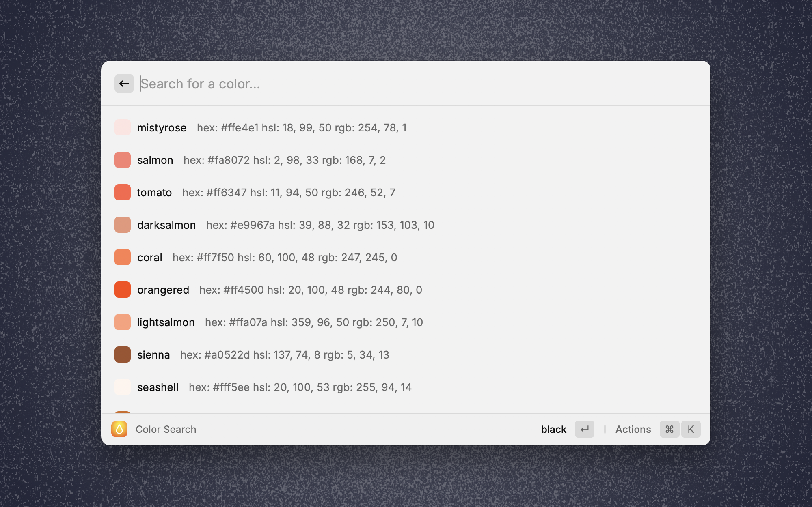
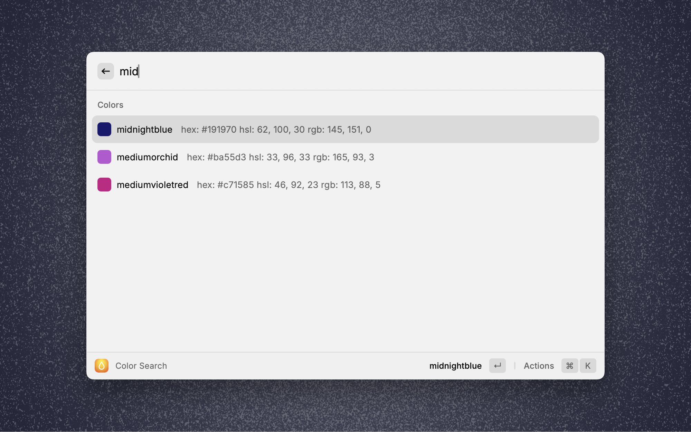
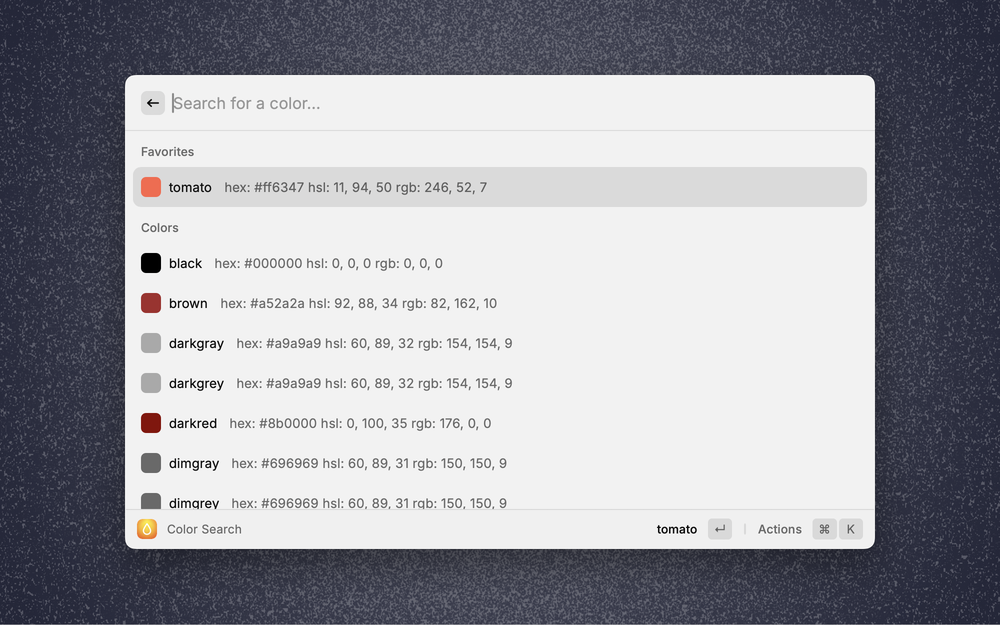
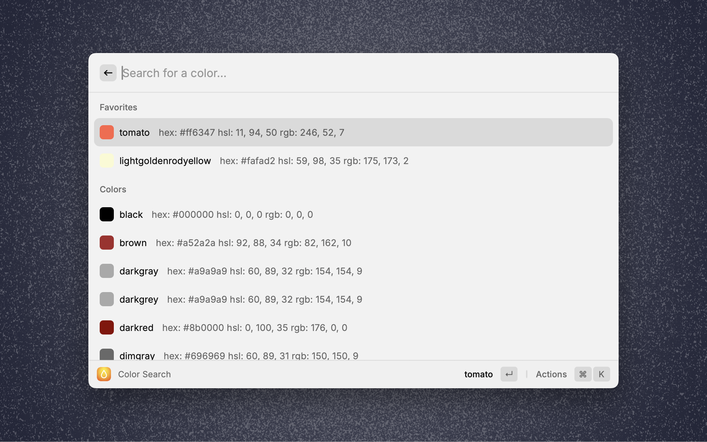
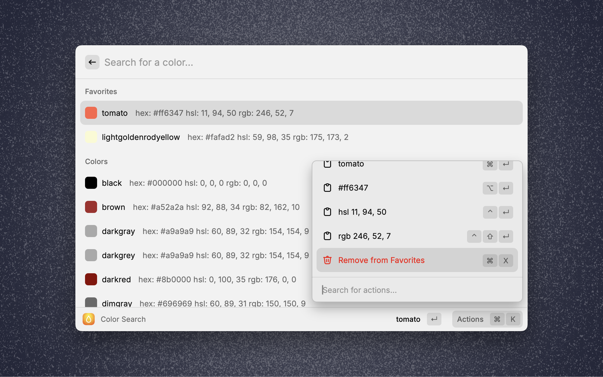
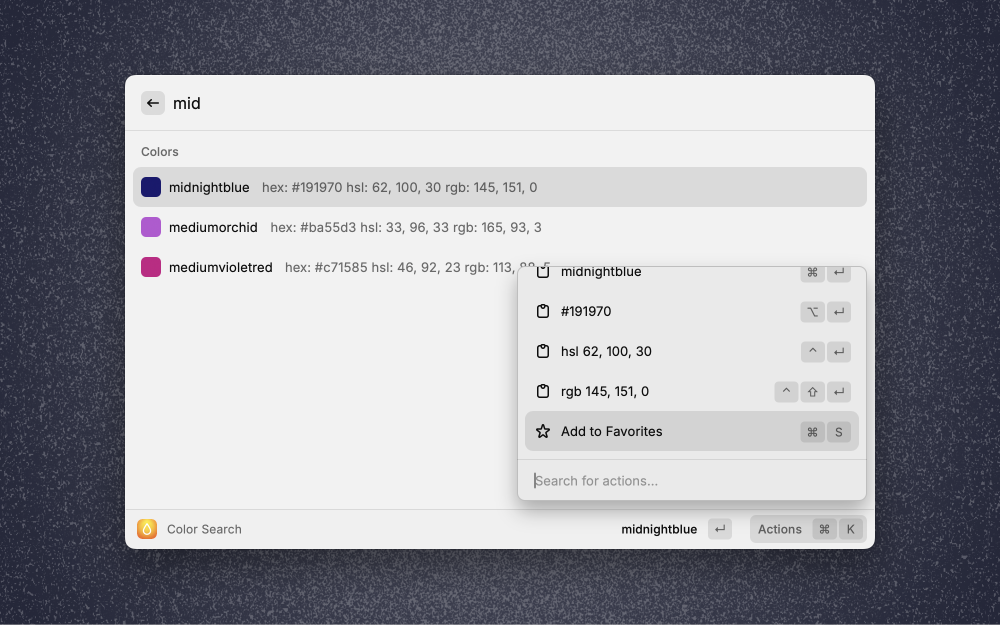

# css color names

<!-- ALL-CONTRIBUTORS-BADGE:START - Do not remove or modify this section -->

[](#contributors-)

<!-- ALL-CONTRIBUTORS-BADGE:END -->

A Raycast extension that provides list of CSS color names with images to search. Has also hex value, rgb and hsl values.

- Currently sorted by hue








## Installation

Currently only by cloning or downloading the repo.

```bash
git clone https://github.com/ff6347/css-color-names-raycast.git
cd css-color-names-raycast
npm ci
npm run build
```

Now use the `Import Extension` command in raycast.

See also https://github.com/ff6347/alfred-color-names

## Contributors ✨

Thanks goes to these wonderful people ([emoji key](https://allcontributors.org/docs/en/emoji-key)):

<!-- ALL-CONTRIBUTORS-LIST:START - Do not remove or modify this section -->
<!-- prettier-ignore-start -->
<!-- markdownlint-disable -->
<table>
  <tbody>
    <tr>
      <td align="center" valign="top" width="14.28%"><a href="https://fabianmoronzirfas.me/"><br /><sub><b>Fabian Morón Zirfas</b></sub></a><br /><a href="https://github.com/ff6347/css-color-names-raycast/commits?author=ff6347" title="Code">💻</a> <a href="#infra-ff6347" title="Infrastructure (Hosting, Build-Tools, etc)">🚇</a> <a href="#design-ff6347" title="Design">🎨</a></td>
    </tr>
  </tbody>
  <tfoot>
    <tr>
      <td align="center" size="13px" colspan="7">
        
          <a href="https://all-contributors.js.org/docs/en/bot/usage">Add your contributions</a>
        </img>
      </td>
    </tr>
  </tfoot>
</table>

<!-- markdownlint-restore -->
<!-- prettier-ignore-end -->

<!-- ALL-CONTRIBUTORS-LIST:END -->

This project follows the [all-contributors](https://github.com/all-contributors/all-contributors) specification. Contributions of any kind welcome!
